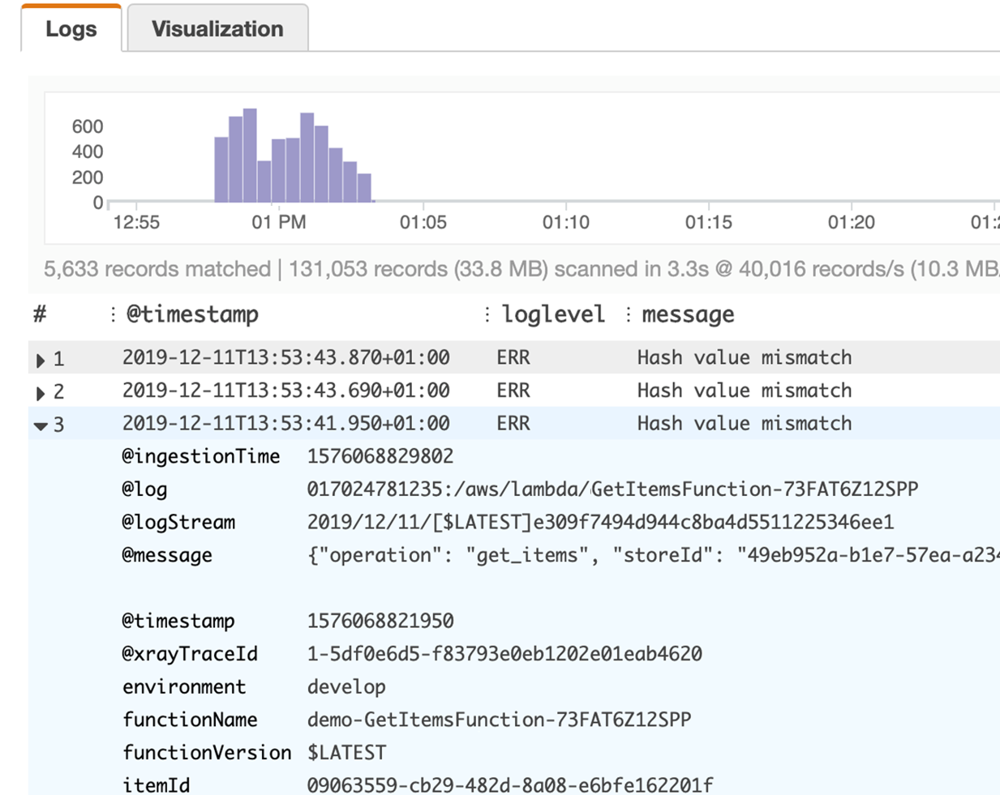
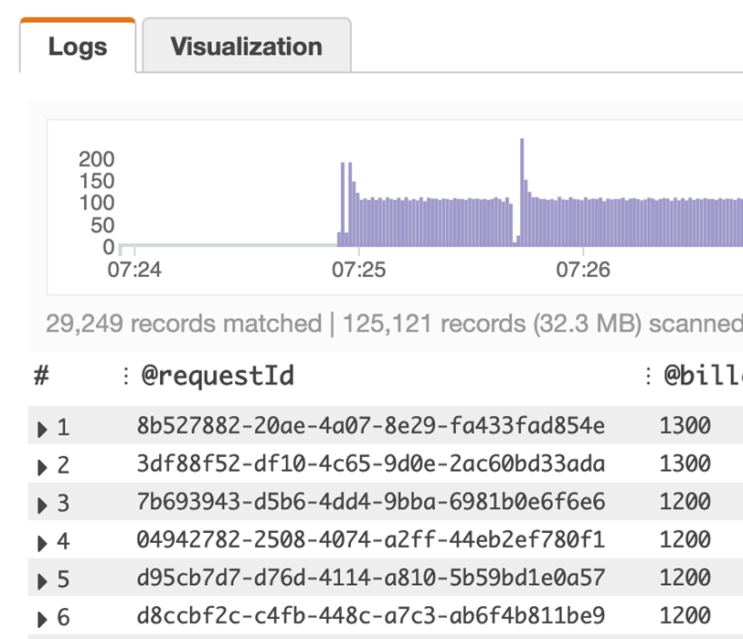
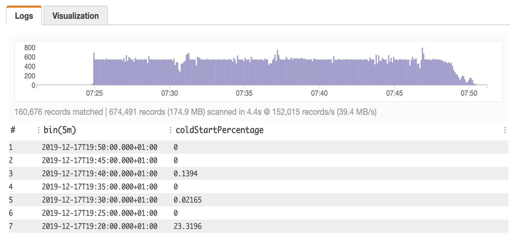
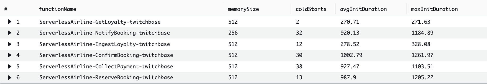
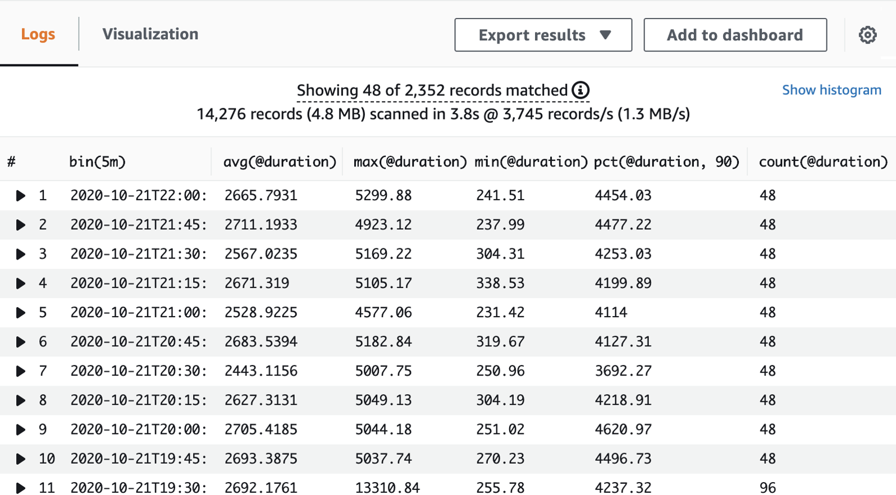
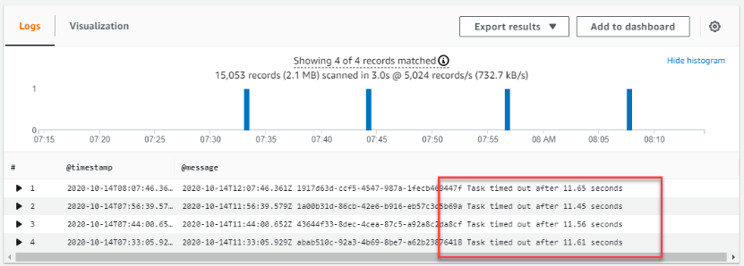

# Serverless Amazon CloudWatch Logs Insights Examples
Example queries using [Amazon CloudWatch Logs Insight](https://docs.aws.amazon.com/AmazonCloudWatch/latest/logs/AnalyzingLogData.html) for Serverless applications.

# Query most recent 100 errors

````
fields Timestamp, LogLevel, Message
| filter LogLevel == "ERR"
| sort @timestamp desc
| limit 100
````

# Top 100 most expensive invocations

````
filter @type = "REPORT"
| fields @requestId, @billedDuration
| sort by @billedDuration desc
| limit 100
````


# Cold start percentage over time
````
filter @type = "REPORT"
| stats
  sum(strcontains(
    @message,
    "Init Duration"))
  / count(*)
  * 100
  as coldStartPercentage,
  avg(@duration)
  by bin(5m)
````


# Cold Starts and InitDuration

````
filter @type="REPORT" 
| fields @memorySize / 1000000 as memorySize
| filter @message like /(?i)(Init Duration)/
| parse @message /^REPORT.*Init Duration: (?<initDuration>.*) ms.*/
| parse @log /^.*\/aws\/lambda\/(?<functionName>.*)/
| stats count() as coldStarts, median(initDuration) as avgInitDuration, max(initDuration) as maxInitDuration by functionName, memorySize
````

# Checking Lambda performance

P90 latency, total invokes, and max latency for a 5 min time window in a table

````
filter @type = "REPORT"
| stats avg(@duration), max(@duration), min(@duration), pct(@duration, 90), count(@duration) by bin(5m)
````


# Exclude informational logs

Excludes common informational logs to report only the errors. In this example it highlights errors:
````
fields @timestamp, @message
| sort @timestamp desc
| filter @message not like 'EXTENSION'
| filter @message not like 'Lambda Insights'
| filter @message not like 'INFO'
| filter @message not like 'REPORT'
| filter @message not like 'END'
| filter @message not like 'START'
````
